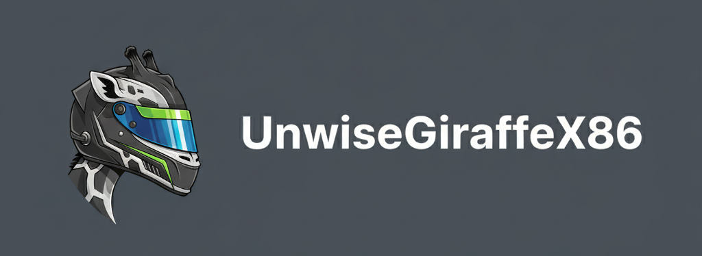

  

### Hi, I'm Ștefan Geala 👋

Electronics & Embedded Hardware Engineer · Bucharest, Romania

---

### 🚀 Engineering Philosophy

I'm an Applied Electronics student at Politehnica Bucharest (FILS) with 5+ years of hands-on hardware projects spanning automotive, IoT, satellite, and industrial security — including a paid client build.

I work across the full hardware lifecycle: **schematic design → PCB layout → BOM → SMD assembly → bring-up → bench verification → documentation.** I'm comfortable in the lab with oscilloscopes, logic analyzers, multimeters, and power analyzers, and I can read and debug schematics and PCB layouts as part of measurement planning.

I approach engineering the way an F1 team approaches a car: every subsystem measured, every iteration validated, every gram of performance earned through disciplined testing.

---

### 🔥 GitHub Telemetry

  

---

### 🔧 The Toolkit

  <strong>Hardware & EDA (The Chassis & ECU):</strong> 
  
  
  

  <strong>MCU / SoC:</strong> 
  
  
  
  
  

  <strong>Interfaces:</strong> CAN-FD · I²C · SPI · UART · USB · USB-PD · PWM · Ethernet

  <strong>Lab Instruments:</strong> Oscilloscope · Logic Analyzer · Multimeter · Power Analyzer

  <strong>Languages & Tools (The Pit Crew):</strong> 
  
  
  
  
  
  
  
  
  

---

### 🏁 Current Work

#### **Electronics Engineer — PULSAR UPB** · European Rover Challenge · *2025 – Present*
Built **CanSnif**, a CAN-FD sniffer and data logger for rover drivetrain debugging. Full PCB designed in KiCad with controlled-impedance traces, length-matched differential pairs, and EMI mitigation. Added a **15 μA standby mode** that wakes on rover power-up, validated on the bench with a power analyzer. Supporting root-cause investigations on CAN bus issues using logic analyzer captures and custom C++ tooling.

#### **Automotive Control System** · Bachelor's Project · *2025 – Present*
Building a full automotive control system from scratch — power delivery, safety (ABS, TCS, ESP), ECU, infotainment, and audio. Each module is verified independently before integration.
- **First module:** 100 W USB-PD power board — ATtiny1614, I²C PD negotiation, dual buck converters, reverse-polarity protection. Schematic complete, PCB layout in progress.
- Evaluating long-run display signal constraints for a 1080p+ 800-nit OLED touch driver.

#### **Founder & Head Mentor — Rosetti Robotics** · *2024 – Present*
Founded and led a **25-person FTC robotics team** across hardware, software, and strategy sub-teams through a full competition season (22nd/33).

---

### 🏆 Podium Finishes

#### **Freelance Hardware Engineer — Industrial IoT Security Device** · *2024*
Designed and delivered a **tamper-detection device for a paying client**. Full pipeline: KiCad schematic and PCB, component selection, BOM, SMD assembly, unit flashing, and bench validation of I²C/SPI sensor interfaces on ESP32. Delivered test documentation and handoff notes.

#### **BEST Engineering Hackathon — 3rd Place** · *2025*
Led a 4-person team to build **EnviroSense**: a sensor data pipeline with privacy scrubbing, a Random Forest model linking air pollution to cognitive health, and an AI agent trained on EU safety legislation.

#### **Urban Microclimates Research — 1st Place, National Science & Research Competition** · *2023*
Custom PCB with temperature, humidity, pressure, and PM2.5/PM10 sensors, deployed across multiple sites in Bucharest. Live React/Flask dashboard for real-time visualization.

#### **Axes Hackathon — 1st Place** · Urban IoT & Smart City Challenge · *2023*
Wrote firmware and data pipeline from scratch, processing **100k+ readings/day** into a live dashboard with real-time congestion and emissions tracking.

#### **Qube2Space — 1st Place** · PocketQube Competition · *2022*
Designed and built a **5×5×5 cm PocketQube satellite** in 10th grade. Three stacked boards (power, sensors, comms) in KiCad. STM32 firmware logged pressure, acceleration, ozone, temperature, and weather data to onboard SD throughout a flight to **9 km altitude**.

---

### 🎓 Education

**B.Sc. Applied Electronics (English-taught)** — Politehnica Bucharest, FILS · *2025 – Present*
Relevant coursework: analog and digital circuit theory, microcontroller systems, schematic and PCB design, signal measurement techniques, electromagnetism, IoT systems.

*5+ years of independent hardware projects running in parallel with formal studies.*

---

### 🗣️ Languages

Romanian (Native) · English (Fluent)

---

### 📫 Get in Touch

  
  
  
  

